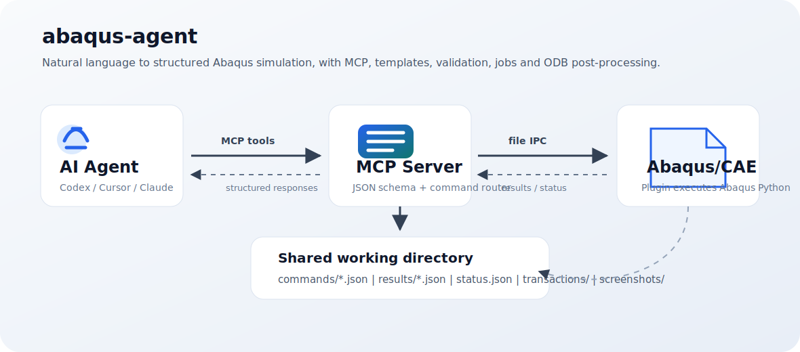
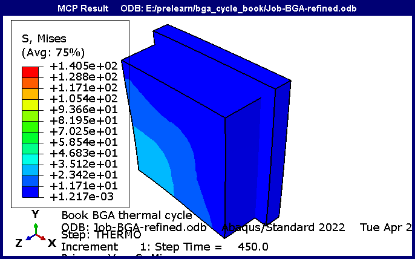
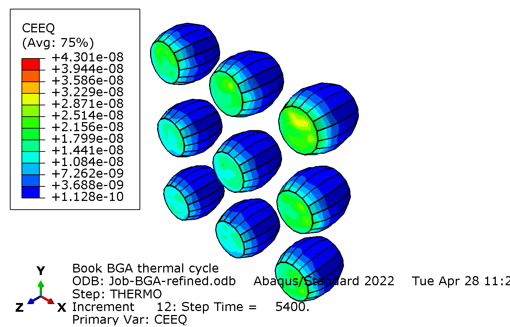
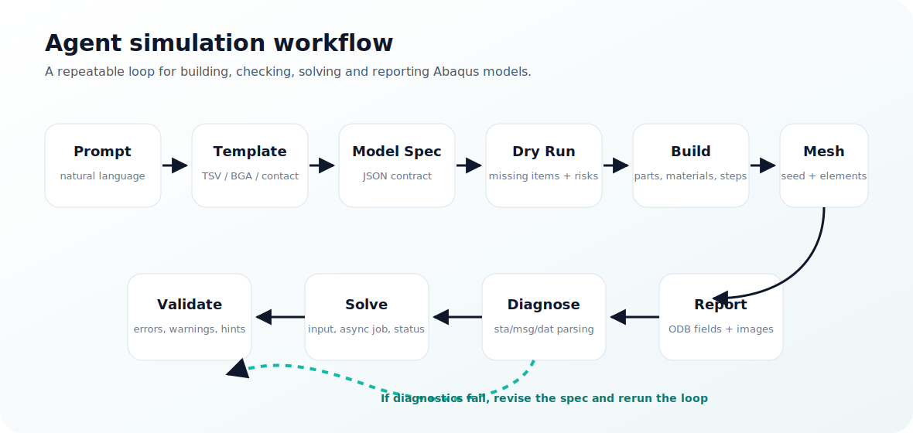

# abaqus-agent

`abaqus-agent` 是一个面向 Abaqus/CAE 的 AI 仿真代理框架。它基于 MCP（Model Context Protocol）和文件式 IPC，把 Codex、Cursor、Claude Desktop 等 Agent 连接到 Abaqus，让 Agent 可以从自然语言任务出发，完成建模、检查、网格、提交作业、诊断失败和 ODB 后处理。

本项目在 [`Cai-aa/abaqus-mcp`](https://github.com/Cai-aa/abaqus-mcp) 的基础上扩展：保留原有 `execute_script` 兜底能力，同时新增结构化有限元 API 和模板系统，让 Agent 不再每次临时拼 Abaqus Python，而是通过稳定工具完成常见仿真流程。



## 适合做什么

- 用自然语言驱动 Abaqus/CAE 建模和求解。
- 自动生成 TSV 热循环、BGA 热循环、单轴拉伸、接触压入、热分析等模型。
- 在建模前做 dry run，提前发现缺材料、缺集合、缺边界、缺输出变量等问题。
- 提交 Abaqus Job 后持续查询状态，解析 `.sta`、`.msg`、`.dat` 诊断求解失败。
- 从 ODB 中查询应力、应变、温度、历史输出曲线，并导出云图和报告。
- 在 Codex/Cursor 这类 Agent 内部查看 Abaqus 结果截图，减少手工切换软件。

## 效果预览

下面是通过 `export_contour_image` 从 ODB 自动导出的 Mises 应力云图示例。



下面是 BGA 热循环模型求解后，从同一个 ODB 的 5400 s 结果帧导出的焊球 CEEQ 云图。



## 核心架构

`abaqus-agent` 使用文件式 IPC，不需要 Abaqus 开 socket 服务，因此对不同 Abaqus/CAE 版本更稳。

- MCP Client：Codex、Cursor、Claude Desktop 或其他支持 MCP 的 Agent。
- `mcp_server.py`：运行在普通 Python 3 环境中，负责暴露 MCP 工具、校验 JSON spec、写入命令文件。
- `abaqus_mcp_plugin.py`：运行在 Abaqus/CAE 内部，轮询命令、执行 Abaqus Python、写回结果。
- `commands/`、`results/`、`status.json`：两端通信目录。
- `templates/`：参数化仿真模板。
- `transactions/`：模型修改、脚本、验证和截图的可追溯记录。

## Agent 工作流



推荐让 Agent 按下面流程工作：

1. 用户用自然语言描述仿真任务。
2. Agent 调用 `list_templates`，选择合适模板。
3. Agent 调用 `instantiate_template`，生成结构化 model spec。
4. Agent 调用 `validate_model_spec` 做 Python 3 侧 JSON 校验。
5. Agent 调用 `create_or_update_model_from_spec(dry_run=true)` 预检对象、缺失项和风险。
6. Agent 调用 `create_or_update_model_from_spec(dry_run=false)` 在 Abaqus 中建模。
7. Agent 调用 `validate_model` 检查材料、截面、集合、边界、接触、网格和输出请求。
8. Agent 调用 `write_input` 或 `submit_job_async` 生成/提交作业。
9. Agent 调用 `get_job_status` 和 `parse_job_diagnostics` 追踪收敛和错误。
10. Agent 调用 `query_odb_field`、`extract_xy_history`、`export_contour_image`、`export_report` 做后处理。

## 功能清单

### 结构化建模

- `create_or_update_model_from_spec(spec, dry_run=false)`：用 JSON spec 创建或更新 Abaqus 模型。
- `validate_model_spec(spec)`：在 MCP server 侧校验 spec 基本结构。
- `validate_model(model_name)`：在 Abaqus 侧检查模型完整性，并返回可机器读取的 `error`、`warning`、`fix_hint`。
- `mesh_model(model_name)`：按 spec 或默认设置划分网格。

### 模板系统

内置模板：

- `tsv_thermal_cycle`：TSV 铜柱/硅基体热循环应力模型。
- `bga_thermal_cycle`：BGA 封装热循环模型。
- `uniaxial_tension`：单轴拉伸。
- `contact_indentation`：接触压入。
- `heat_transfer`：稳态/瞬态热分析。

每个模板目录包含：

- `defaults.json`：默认参数。
- `schema.json`：参数约束。
- `example_prompt.md`：自然语言提示示例。

### 作业生命周期

- `write_input`：只写 `.inp`，不提交。
- `submit_job_async`：异步提交作业。
- `get_job_status`：查询作业状态和轻量诊断。
- `cancel_job`：取消正在运行的作业。
- `parse_job_diagnostics`：解析 `.sta`、`.msg`、`.dat`，把收敛失败、接触问题、单元畸变等信息转为修复建议。

### ODB 后处理

- `get_odb_info`：读取 ODB 元数据。
- `query_odb_field`：按 step、frame、变量、invariant、instance、element set 查询 min/max/avg 和位置。
- `extract_xy_history`：导出历史曲线。
- `export_contour_image`：按固定视角导出云图。
- `export_report`：生成 Markdown 结果报告。
- `get_viewport_image`：截取 Abaqus 当前视口。

### 兼容原始能力

- `execute_script`：专家模式兜底，直接在 Abaqus/CAE 内执行 Abaqus Python。
- `get_model_info`：返回模型树、part、material、section、step、BC、load、interaction、mesh、set/surface 等信息。
- `list_jobs`、`submit_job`、`ping`、`check_abaqus_connection`：保留原有基础工具。

## 安装

### 1. 克隆项目

```bash
git clone https://github.com/nellikassa566-ops/abaqus-agent.git ~/.abaqus-agent
cd ~/.abaqus-agent
```

Windows 也可以克隆到：

```powershell
git clone https://github.com/nellikassa566-ops/abaqus-agent.git "$env:USERPROFILE\.abaqus-agent"
cd "$env:USERPROFILE\.abaqus-agent"
```

### 2. 安装 MCP server 依赖

普通 Python 3 环境中执行：

```bash
pip install mcp
```

### 3. 配置 MCP client

在 Codex、Cursor 或 Claude Desktop 的 MCP 配置中加入：

```json
{
  "mcpServers": {
    "abaqus-agent": {
      "command": "python",
      "args": ["C:/Users/YourUsername/.abaqus-agent/mcp_server.py"]
    }
  }
}
```

如果仍然放在 `.abaqus-mcp` 目录，也可以把路径改成：

```json
{
  "mcpServers": {
    "abaqus-agent": {
      "command": "python",
      "args": ["C:/Users/YourUsername/.abaqus-mcp/mcp_server.py"]
    }
  }
}
```

### 4. 让 Abaqus 加载插件

推荐复制示例环境文件：

```powershell
Copy-Item "$env:USERPROFILE\.abaqus-agent\abaqus_v6.env.example" "$env:USERPROFILE\abaqus_v6.env"
```

也可以手动在 Abaqus/CAE 中执行：

```python
execfile(r"C:\Users\YourUsername\.abaqus-agent\abaqus_mcp_plugin.py")
```

### 5. 启动 Abaqus 侧监听

在 Abaqus/CAE Python Console 中执行：

```python
mcp_start()
```

如果你的 Abaqus 版本对后台线程不稳定，可以使用更保守的阻塞模式：

```python
mcp_loop()
```

插件菜单安装后，也可以从 Abaqus 菜单启动：

```text
Plug-ins -> MCP -> Start MCP
```

## 快速使用

### 检查连接

让 Agent 调用：

```text
check_abaqus_connection
```

成功后会返回 Abaqus 插件状态、版本和工作目录。

### 创建一个 TSV 热循环模型

可以直接对 Agent 说：

```text
使用 Abaqus 做一个三维 TSV 热循环应力模型：
四周是硅，中间是铜圆柱体，不考虑二氧化硅；
按热循环曲线加载温度，生成网格，提交作业；
最后导出 450 s 的 Mises 最大值和一张云图。
```

Agent 应该优先走结构化工具：

```text
list_templates
instantiate_template(template_id="tsv_thermal_cycle")
validate_model_spec
create_or_update_model_from_spec(dry_run=true)
create_or_update_model_from_spec(dry_run=false)
validate_model
mesh_model
submit_job_async
get_job_status
query_odb_field
export_contour_image
export_report
```

### 创建一个 BGA 热循环模型

可以对 Agent 说：

```text
按照 BGA 热循环模拟的经典步骤建立三维封装模型，
材料、截面、热循环 step、边界、网格和输出都要建好；
求解后查询指定时刻 Mises、CEEQ 和 ALLCD 历史曲线。
```

对应模板：

```text
bga_thermal_cycle
```

## Model Spec 示例

下面是一个极简示例。实际 spec 可以由模板自动生成。

```json
{
  "model_name": "TSV-Thermal-Cycle",
  "template_id": "tsv_thermal_cycle",
  "parameters": {
    "silicon_size": [100.0, 100.0, 100.0],
    "copper_radius": 5.0,
    "copper_height": 100.0,
    "initial_temperature": 25.0,
    "cycle_temperatures": [25.0, 125.0, -40.0, 25.0],
    "cycle_times": [0.0, 450.0, 2700.0, 5400.0],
    "mesh_size": 5.0
  }
}
```

## 本地验证

普通 Python 单元测试：

```powershell
python -m unittest discover -s tests -p "test*.py"
python -m py_compile abaqus_mcp_tools.py mcp_server.py abaqus_mcp_plugin.py
```

Abaqus smoke test：

```powershell
abaqus cae noGUI=C:\Users\YourUsername\.abaqus-agent\tests\abaqus_smoke_structured.py
abaqus cae noGUI=C:\Users\YourUsername\.abaqus-agent\tests\abaqus_smoke_odb.py
```

已验证的检查点包括：

- 结构化 API 单元测试通过。
- `abaqus_smoke_structured.py` 可以 dry run、建模、验证并写出 `.inp`。
- `abaqus_smoke_odb.py` 可以查询 Mises、ALLCD，并导出云图。

## 目录结构

```text
abaqus-agent/
├── abaqus_mcp_plugin.py        # Abaqus/CAE 内部插件
├── abaqus_mcp_tools.py         # 结构化 spec、模板和诊断工具
├── mcp_server.py               # MCP server 入口
├── templates/                  # 参数化仿真模板
├── tests/                      # Python 和 Abaqus smoke tests
├── docs/images/                # README 图片
├── commands/                   # 运行时命令目录，git 忽略
├── results/                    # 运行时结果目录，git 忽略
├── screenshots/                # 运行时截图目录，git 忽略
└── transactions/               # 事务日志目录，git 忽略
```

## 设计原则

- 结构化工具优先，`execute_script` 只作为专家兜底。
- 建模前先 dry run，减少 Abaqus 内部失败成本。
- 每个工具返回 machine-readable JSON，方便 Agent 自动修复。
- 不改 socket 服务，继续使用文件式 IPC，优先保证 Abaqus 兼容性。
- 模板先覆盖高频任务，不追求一次覆盖全部 Abaqus 功能。

## 当前限制

- Abaqus/CAE 必须已经启动，并加载 `abaqus_mcp_plugin.py`。
- 部分高级几何、复杂接触和用户子程序仍需要 `execute_script` 扩展。
- ODB 查询依赖 ODB 中实际存在的 field/history output。
- 不同 Abaqus 版本的 GUI 截图行为可能略有差异。

## License

本项目沿用原仓库许可证。见 [LICENSE](LICENSE)。
